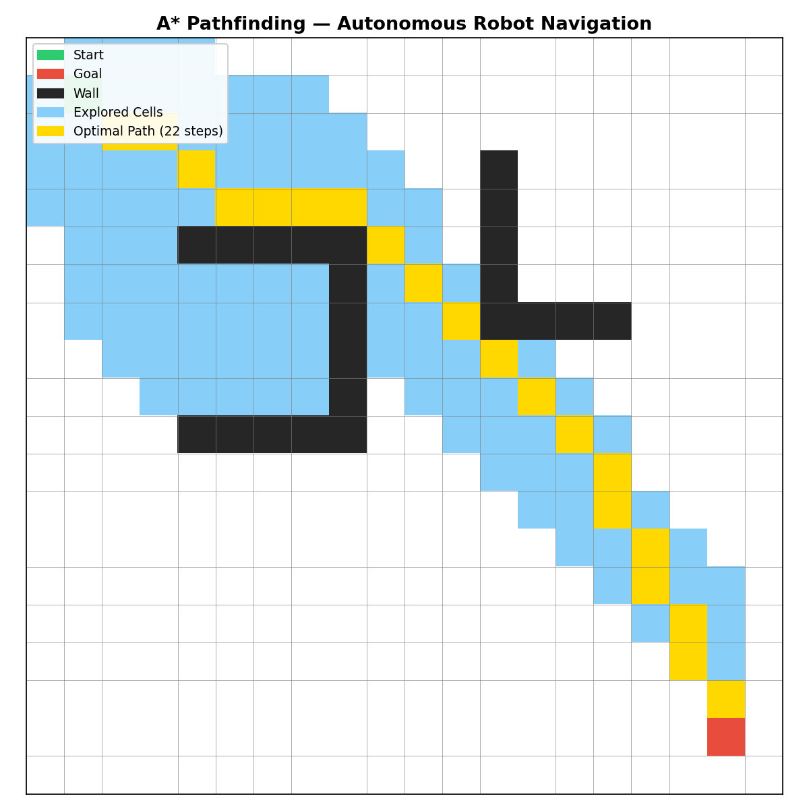

# A* Pathfinding — Autonomous Robot Navigation

A Python implementation of the **A\* search algorithm** for autonomous robot navigation, 
visualized on a 2D grid with obstacles.



## What is A*?

A* is one of the most widely used pathfinding algorithms in robotics and autonomous systems.
It finds the **optimal (shortest) path** between two points while avoiding obstacles using:

$$f(n) = g(n) + h(n)$$

| Term | Meaning |
|------|---------|
| `g(n)` | Actual cost from start to current node |
| `h(n)` | Estimated cost to goal (Euclidean heuristic) |
| `f(n)` | Total estimated path cost |

The algorithm always expands the node with the **lowest f(n)** first — 
guaranteeing the optimal path.

## Features
- 20×20 navigable grid with custom wall obstacles
- 8-directional movement (diagonal cost = √2 ≈ 1.414)
- Euclidean distance heuristic
- Full visualization of explored cells and optimal path

## How to Run

```bash
pip install matplotlib numpy
python astar.py
```

## Output
- **Yellow** — Optimal path
- **Blue** — All explored cells
- **Black** — Wall obstacles
- **Green** — Start position
- **Red** — Goal position

## Technologies
- Python
- NumPy
- Matplotlib